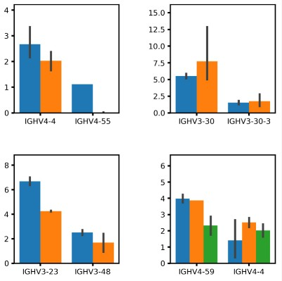

# AUS

## Overview
Antibody upstream sequence (AUS) repository contains all key python scripts for reproducing results in ***"Antibody Upstream Sequence Diversity and Its Biological Implications Revealed by Repertoire Sequencing"*** (doi: https://doi.org/10.1101/2020.09.02.280396). These scripts include those employed for AUS identification and filtration and those for characterizing the identified AUS from different species. 


## Table of contents
* [AUS identification](#aus-identification)
	* [AUS identification for human](#aus-identification-for-human)
	* [AUS identification for non-human species](#aus-identification-for-non-human-species)
	* [AUS scoring and filtration](#aus-scoring-and-filtration)

* [Characterization analyses](#characterization-analyses)
	* [AUS similarity (Figure 3)](#aus-similarity-figure-3)
		* [5'UTR and leader similarity within human](#5utr-and-leader-similarity-within-human)
		* [5'UTR and leader similarity between human and other species](#5utr-and-leader-similarity-between-human-and-other-species)
	* [AUS function (Figure 5)](#aus-function-figure-5)
		* [Upstream open reading frame analyses (uORF)](#upstream-open-reading-frame-analyses-uorf)
		* [Leader and gene expression correlation](#leader-and-gene-expression-correlation)
#### Upstream open reading frame analyses (uORF)

## AUS identification

### AUS identification for human

### AUS identification for non-human species
`python nonhuman_aus_identification.py cloneFl alignFl primer sample leader_imgt.fasta utr_imgt.fasta isotype`

The script, `nonhuman_aus_identification.py`, accepts seven commandline parameters and outputs a single file recording the candidate AUSs for each sample.

The comandline parameters include,
* `cloneFl`: clone file output by MiXCR
* `alignFl`: alignment file output by MiXCR
* `primer`: primer sequence upstream AUS
* `sample`: sample id
* `leader_imgt.fasta`: leader reference sequences from IMGT (in fasta format)
* `utr_imgt.fasta`: UTR reference sequences from IMGT (in fasta format)
* `isotype`: isotype

The output file, (i.e. `sample.upstream.sequence.fasta`), looks like,
```
Allele	Group	Flag	Rank	alleleCount	novelCount	Sequence	leaderStart	seqFreq	cloneFreq	readFreq	seqIdentity	SampleId	Isotype	seq_ref	IMGT_leader	IMGT_utr	leader	utr	ATG_Substring
IGHV1S2*01	Homozygote	upstream	1	NA	366	ACATCACACAACAATCACATCCCTCCCCTACAGAAGTCCCCAGAGCACAGCACCTCACCATGGACTGGACATGGAGGATCCTCCTCTTGGTGGCAGCAGCTACAGGCGCCCACTCC	59	0.177595628415	65	422	0.9873003487935349	MFS01	IgM	ACATCACACAACAATCACATCCCTCCCCTACAGAAGTCCCCAGAGCACAGCACCTCACCATGGACTGGACATGGAGGATCCTCCTCTTGGTGGCAGCAGCTACAGGCGCCCACTCC_IGHV1S2*01	1	2	ATGGACTGGACATGGAGGATCCTCCTCTTGGTGGCAGCAGCTACAGGCGCCCACTCC	ACATCACACAACAATCACATCCCTCCCCTACAGAAGTCCCCAGAGCACAGCACCTCACC	GCACAGCACCTCACCATGGACTGGACATGGAGG
IGHV1S2*01	Homozygote	upstream	2	NA	366	ATCACACAACAACCACATCCCTCCCCTAAAGAAGCCCCAGAGCACAGCATCTCACCATGGACTGGACCTGGAGGATCCTCCTCTTGGTGGCAGCAGCTACAGGTGCCCACTCC	56	0.106557377049	39	246	0.9752896547841291	MFS01	IgM	ATCACACAACAACCACATCCCTCCCCTAAAGAAGCCCCAGAGCACAGCATCTCACCATGGACTGGACCTGGAGGATCCTCCTCTTGGTGGCAGCAGCTACAGGTGCCCACTCC_IGHV1S2*01	1	2	ATGGACTGGACCTGGAGGATCCTCCTCTTGGTGGCAGCAGCTACAGGTGCCCACTCC	ATCACACAACAACCACATCCCTCCCCTAAAGAAGCCCCAGAGCACAGCATCTCACC	GCACAGCATCTCACCATGGACTGGACCTGGAGG
IGHV4S9*01	Homozygote	upstream	1	NA	113	ATGCTCTCTGAGAGTCACGGACATCCTGTGCAAGAACATGAAGCATCTGTGGTTCTTCCTCCTCCTGGTGGCAGCTCCCAGATGGGTCCTGTCC	37 0.106194690265	12	46	0.9230814293732988	MFS01	IgM	ATGCTCTCTGAGAGTCACGGACATCCTGTGCAAGAACATGAAGCATCTGTGGTTCTTCCTCCTCCTGGTGGCAGCTCCCAGATGGGTCCTGTCC_IGHV4S9*01	1	2	ATGAAGCATCTGTGGTTCTTCCTCCTCCTGGTGGCAGCTCCCAGATGGGTCCTGTCC	ATGCTCTCTGAGAGTCACGGACATCCTGTGCAAGAAC	ATCCTGTGCAAGAACATGAAGCATCTGTGGTTC
.
.
.
IGHV4S10*01	Homozygote	upstream	2	NA	1488	CTCTCTGAGAGTCACGGACATCCTGTGCAAGAACATGAAGCACCTGTGGTTCTTCCTCCTGCTGGTGGCAGCTCCCAGATGGGTCCTGTCC	34 0.0745967741935	111	303	0.9161023448644536	MFS01	IgM	CTCTCTGAGAGTCACGGACATCCTGTGCAAGAACATGAAGCACCTGTGGTTCTTCCTCCTGCTGGTGGCAGCTCCCAGATGGGTCCTGTCC_IGHV4S10*01	1	2	ATGAAGCACCTGTGGTTCTTCCTCCTGCTGGTGGCAGCTCCCAGATGGGTCCTGTCC	CTCTCTGAGAGTCACGGACATCCTGTGCAAGAAC	ATCCTGTGCAAGAACATGAAGCACCTGTGGTTC
IGHV4S17*01	Homozygote	upstream	1	NA	815	ACATGGGAAATGTTCTCTGAGAGTCACGGACCTCCTGGGCAAGAACATGAAGCATCTGTGGTTCTTCCTCCTCCTGGTGGCAGCTCCCAGATGGGTCCTGTCC	46	0.0895705521472	73	215	0.9133824417540037	MFS01	IgM	ACATGGGAAATGTTCTCTGAGAGTCACGGACCTCCTGGGCAAGAACATGAAGCATCTGTGGTTCTTCCTCCTCCTGGTGGCAGCTCCCAGATGGGTCCTGTCC_IGHV4S17*01	1	2	ATGAAGCATCTGTGGTTCTTCCTCCTCCTGGTGGCAGCTCCCAGATGGGTCCTGTCC	ACATGGGAAATGTTCTCTGAGAGTCACGGACCTCCTGGGCAAGAAC	CTCCTGGGCAAGAACATGAAGCATCTGTGGTTC
IGHV4S17*01	Homozygote	upstream	2	NA	815	ATGCTCTCTGAGAGTCATGGACATCCTGTGCAAGAACATGAAGCACCTGTGGTTCTTCCTCCTCCTGGTGGCAGCTCCCAGATGGGTCCTGTCC	37 0.080981595092	66	175	0.9326956172551308	MFS01	IgM	ATGCTCTCTGAGAGTCATGGACATCCTGTGCAAGAACATGAAGCACCTGTGGTTCTTCCTCCTCCTGGTGGCAGCTCCCAGATGGGTCCTGTCC_IGHV4S17*01	1	2	ATGAAGCACCTGTGGTTCTTCCTCCTCCTGGTGGCAGCTCCCAGATGGGTCCTGTCC	ATGCTCTCTGAGAGTCATGGACATCCTGTGCAAGAAC	ATCCTGTGCAAGAACATGAAGCACCTGTGGTTC
```

Due to the primer difference between the in-house dataset and public dataset (`PRJEB15295` and `PRJNA503527`), the parameters employed for identifying AUS for these datasets are different. Three variant scripts are also provided in the `scripts` directory. The samples for which they apply to are provided in `scripts/aus_script_and_samples.csv`.


### AUS scoring and filtration
`python aus_score.py discovered_aus_combined.txt leader_imgt.fasta scored_aus.txt`

The script, `aus_score.py`, implements the AUS scoring. It accepts two parameters, including the discovered AUSs combined from all samples and reference leader sequences, and outputs a single scored AUS sequence file.

## Characterization analyses
### AUS similarity (Figure 3)
#### 5'UTR and leader similarity within human
`python utr_sim_cal_visual.py`

The script, `utr_sim_cal_visual.py`, implements the calculation and visualization of 5'UTR sequence similarity. It accepts the scored AUSs (i.e. `human.igh.upstream.score.and.filter.q.0.50.comb.txt`) and output similarity matrix files (i.e. `human.igh.utr.similarity.matrix.csv`) and the corresponding similarity heatmaps (i.e. `human.igh.utr.similarity.matrix.jpg`). The heatmap looks like,


`python leader_sim_cal_visual.py`

The script, `leader_sim_cal_visual.py`, implements the calculation and visualization of leader sequence similarity. It accepts the scored AUSs (i.e. `human.igh.upstream.score.and.filter.q.0.50.comb.txt`) and output similarity matrix files (i.e. `human.igh.leader.similarity.matrix.csv`) and the corresponding similarity heatmaps (i.e. `human.igh.leader.similarity.matrix.jpg`). The heatmap looks like,


#### 5'UTR and leader sharings between V genes
`python human_utr_overlap_btw_gene.py`

The script, `python human_utr_overlap_btw_gene.py`, implement the visualization of the sharing of 5'UTR sequences between genes. It accepts the scored AUS file and the raw AUS file, and outputs heatmaps demonstrating the sharings of 5'UTR sequences between genes. The output heatmamp looks like,


`python human_leader_overlap_btw_gene.py`

The script, `python human_leader_overlap_btw_gene.py`, implement the visualization of the sharing of leader sequences between genes. It accepts the scored AUS file and the raw AUS file, and outputs heatmaps demonstrating the sharings of leader sequences between genes. The output heatmamp looks like,


#### 5'UTR and leader similarity between human and other species (Figure 3e and 3f)
`python utr_sim_btw_human_and_other_species.py`

The script, `utr_sim_btw_human_and_other_species.py`, implements the calculation and visualization of utr sequence similarity between human and other species. It accepts the scored AUSs from both human and other species (i.e. `rhesus.igh.upstream.score.and.filter.q.0.50.comb.txt`) and output similarity tables (i.e. `human.rhesus.v.utr.identity.csv`) and the corresponding scatter plots (i.e. `human.other.species.v.utr.identity.corr.jpg`). The heatmap looks like,


`python leader_sim_btw_human_and_other_species.py`

The script, `leader_sim_btw_human_and_other_species.py`, implements the calculation and visualization of leader sequence similarity between human and other species. It accepts the scored AUSs from both human and other species (i.e. `rhesus.igh.upstream.score.and.filter.q.0.50.comb.txt`) and output similarity tables (i.e. `human.rhesus.v.leader.identity.csv`) and the corresponding scatter plots (i.e. `human.other.species.v.leader.identity.corr.jpg`). The heatmap looks like,


`python utr_sim_btw_human_and_other_species_boxplot.py`

The script, `utr_sim_btw_human_and_other_species_boxplot.py`, implements the calculation and visualization of utr sequence similarity between human and other species in different gene group. It accepts the scored AUSs from both human and other species (i.e. `rhesus.igh.upstream.score.and.filter.q.0.50.comb.txt`), the pre-calculated pairwise gene identity matrix and the core gene list, and output similarity tables (i.e. `human_other_species_utr_similarity_core_and_noncore_igh.csv`) and the corresponding boxplot (i.e. `utr_similarity_cmp_btw_core_noncore_for_diff_species_igh.jpg`). The boxplot looks like,


`python leader_sim_btw_human_and_other_species_boxplot.py`

The script, `leader_sim_btw_human_and_other_species_boxplot.py`, implements the calculation and visualization of leader sequence similarity between human and other species in different gene groups. It accepts the scored AUSs from both human and other species (i.e. `rhesus.igh.upstream.score.and.filter.q.0.50.comb.txt`), the pre-calculated pairwise gene identity matrix and the core gene list, and output similarity tables (i.e. `human_other_species_leader_similarity_core_and_noncore_igh.csv`) and the corresponding boxplot (i.e. `leader_similarity_cmp_btw_core_noncore_for_diff_species_igh.jpg`). The boxplot looks like,


`python v_gene_sim_btw_human_and_other_species_boxplot.py`

The script, `v_gene_sim_btw_human_and_other_species_boxplot.py`, implements the calculation and visualization of v gene sequence similarity between human and other species in different gene groups. It accepts the pre-calculated pairwise gene identity matrix and the core gene list and output a boxplot demonstrating gene similarity distribution (i.e. `v_gene_similarity_cmp_btw_core_noncore_for_diff_species_igh.jpg`). The boxplot looks like,


### AUS function (Figure 5)
#### Upstream open reading frame analyses (uORF)
`python utr_length_cmp_btw_uorf_groups.py`

The script, `utr_length_cmp_btw_uorf_groups.py`, implement the comparison of 5'UTR length between uORF-absent and uORF-containing groups. It accepts discovered AUSs from all enrolled species and outputs the significance of unpaired t-test for each species-chain combination and a barplot demonstrating the 5'UTR length difference between two groups. The barplot looks like,


`python uorf_expr_corr.py`

The script, `python uorf_expr_corr.py`, implement the analysis of correlation between gene expression and number of uORFs. It accepts three kinds of files as input, that includes the gene expression matrix for each sample (i.e. `human.igh.gene.expr.txt`), the scored AUS file, and the raw AUS file recording also the sample information. It outputs barplots demonstrating the correlation between gene expression and the number of uORFs for genes having AUSs with different number of uORFs. The output barplot looks like,


#### Leader and gene expression correlation
`python leader_expr_corr.py`

The script, `python leader_expr_corr.py`, implement the analysis of correlation between gene expression and leader sequences. It accepts three kinds of files as input, that includes the gene expression matrix for each sample (i.e. `human.igh.gene.expr.txt`), the scored AUS file, and the raw AUS file recording also the sample information. It outputs barplots demonstrating the correlation between gene expression and leader sequences for genes with leader polymorphisms. The output barplot looks like,



## Dependencies
In-house scripts above were written in Python (v3.7). Note that a series of modules are required, which include `pandas`, `numpy`, `csv`, `seaborn`, `matplotlib`, `warnings`, `multiprocessing`, `argparse`, `biopython`, `pyforest`, `subprocess`, `Levenshtein`, `scipy`, `sklearn`, `itertools`, and `mpl_toolkits`.

## Others
For scripts performing other analyses in this work, please contact the Lead Contact, Zhenhai Zhang (zhenhaismu@163.com).